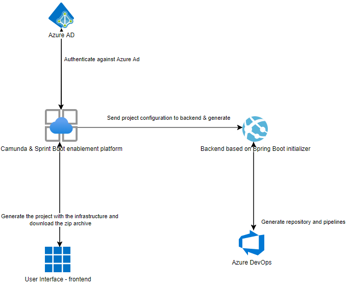

---
author: Michal Stefaniuk, Software Engineer at Devapo (www.devapo.io)

# An Azure platform for quick Camunda enablement
Nowadays many companies from banking sector are moving towards process business automation. 
Where there is a process, a tool like Camunda could be introduced. 
Another approach which seems to be very trendy these days would be migrating to cloud. These two solutions combined
present a huge scale of possibilities, but as they say, with great power comes great responsibility.

Introducing new tools into your architecture sometimes might be really tricky, especially if your project is already live
in the production environment. Moving with your product to cloud might be even more challenging, as this usually requires
major changes in the existing implementation.

Here at Devapo, as an official Camunda partner, for one of our clients from the banking sector we develop a solution, which intends to enable developer
teams to quickly move to Azure cloud with Camunda. In this article I would like to present this concept on its technical level as well its business implications.

## How the platform is utilized? The concept's walkthrough
The goal of the platform was to allow developer teams to quickly move with their Camunda products to Azure cloud. The platform is mainly focused
on automating the process of creating Azure repository, pipelines, including build and infrastructure ones thorugh Azure DevOps REST API.
It's user interface allows to simply select the configuration and particular features that the client is interested in. This concept bridges the gaps
between integrations and bringing custom Camunda features to production.

Once the user accesses the fronted of the platform, authentication and authorization against the Azure AD service begins. After a successful authorization
, the user is prompted with a form that allows to select the project configuration. Among those options, the client can choose particular dependencies, their versions, custom features and the environment's setup. The platform
allows generating only the projects with embedded edition of Camunda, however the development effort is reduced significantly. The custom
features that the platform provides are for instance

* Camunda Custom Identity service,
* Camunda with LDAP,
* Camunda with Azure AD authentication and authorization,
* Camunda with Azure SQL Database and automated database migrations,
* Camunda event-driven by Azure Functions,
* Camunda with secrets stored in Azure Key Vault,
* Camunda with process definitions stored in Azure Blob,
* Camunda delegates with Azure Service Bus connectivity

and many others. Once the platform's client chooses the particular configuration, the frontend layer communicates with the backend 
through a http POST, that contains in it's the body all the configuration that the client chose. The backend layer is very simple - it is a Spring Boot application that implements the official Spring initializr project (https://github.com/spring-io/initializr).
From a technical point of view, it contains three packages.
* generator - contains java Beans that implement so called `contributor` classes provided by Spring intializer and they describe the way that the 
  project should be generated regarding the configuration in the HTTP Post request. It is responsible to utilize the logic on which of the custom Camunda features should
  be included in the project generation.
* metadata - this package holds the template of the project files which will be used in the project generation (like *java files, *bpmn files or any other static resources necessary for a Spring Boot & Camunda application). This package is also
responsible for generation of Spring Boot configuration and it will be used by the contributor classes called in `generator` package.
* web - the last package is the one that holds a bunch of controllers and is responsible for receiving HTTP requests. It also delegates the project generation
to the particular contributor class of `generator` package after parsing HTTP requests body content.
  
Before the zip file of the freshly generated project can be returned by the backend, it does one more thing - through the REST template it communicates with the Azure DevOps API
and it creates the Azure repository with the chosen Spring Boot and Camunda application and it creates build and infrastructure pipelines which are ready to be used. This part is
extremely important - we need to notice that at this point the client is not only provided with a Spring Boot & Camunda application with custom features, but
also with a pipelines, that are ready to be run, so the effort that usually needs to take place when creating cloud resources and whole deployment infrastructure is
gone. This approach is called IAAC (infrastructure as a code) and is a huge enablement for the developer teams. Once this part is finished,
the client ends up with the necessary cloud infrastructure and a Spring Boot & Camunda application which is already in Azure repository,
but in addition a client also gets to download a ZIP archive of the project.

## Conclusion
* Your use case, including how Camunda and/or process automation has helped your
  organization
* An interesting customer success story made possible with process automation
* How you solved a problem or challenge you were facing
* Why you chose a particular technology, built a specific project, or worked on a piece of
  software
* How you applied what you learned in your introduction
  Let the reader know they’ve made it to the end. Finish your post with a brief restatement of your
  main point. Tell the reader you hope they found your post helpful and encourage them to get
  started with your idea.
  
-----------------
* the platform is easily accessible,
* it is a guidance for developers who are trying to introduce Camunda projects on cloud,
* the platform saves not only a lot of engineering effort, but an estimated cost of millions of euro,
* the presence of the platform creates developer friendly standards in the company organizations,
* the platform reduces the need of customizing Camunda through boilerplate code by using production ready solutions or solution patterns
* this approach allows to quickly introduce highly scalable Camunda based applications on cloud without a lot of specialized knowledge

## Key Takeaways and CTAs
Here's where you can highlight the top 3-4 key takeaways a reader can bring back to their
organization after having read your article. These are high-level, one-sentence summaries of
each of your paragraphs. For example:
* Here's how you implement process automation
* Why our organization chose Camunda
* Relying on data is important
* In the end, automation = success
  Close out your post with an explicit call to action that says what you’d like the reader to do next:
  sign up for an account, use a particular feature, build something, etc. If nothing else, ask the
  reader to leave you a comment about the post or join us on the Camunda community forums.