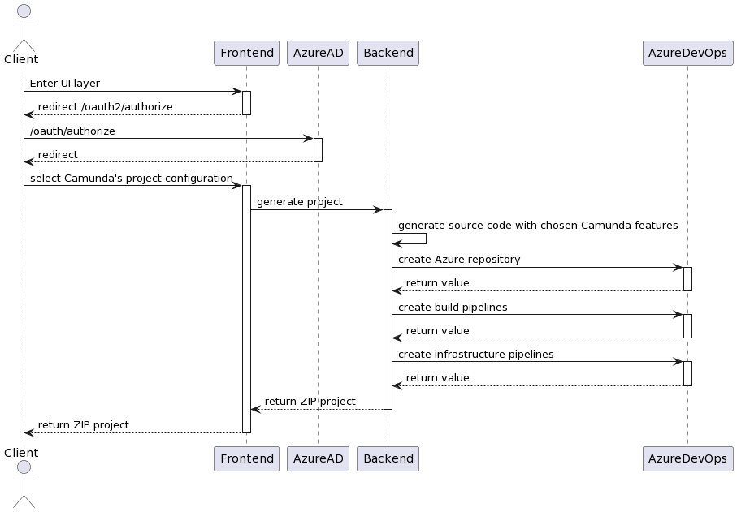
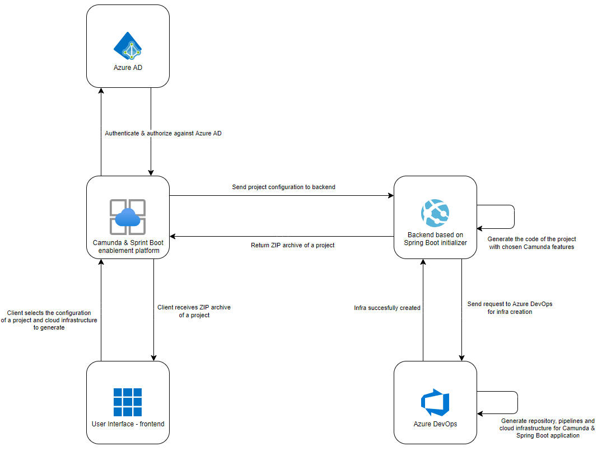

---
author: Michal Stefaniuk, Software Engineer at Devapo (www.devapo.io)

# Quick Camunda enablement with Azure – a simple business case
Plenty of companies from the banking sector are moving towards business process automation. Where there is a process, a tool like Camunda - workflow and decision automation platform - could be introduced. Another trending approach these days would be migrating to the cloud. Combining these two solutions
allows to unlock a huge scale of possibilities. But as they say, with great power comes great responsibility.

Introducing new tools into technical architecture sometimes getes really tricky, especially if your project is already live in the production environment. Moving your product to the cloud might be even more challenging, as this shift usually requires
major changes in the existing implementation.

Here at Devapo, an official Camunda partner, for one of our clients from the banking sector we developed a solution, which enables develoment teams to quickly move to Azure cloud with Camunda. In this article I will present this concept on a technical level as well its business implications.

## How is the platform implemented? The concept's walkthrough
The goal of the platform was to allow development teams to quickly move with their Camunda products to Azure cloud. The platform is mainly focused on automating the processes of creating Azure repository and pipelines, including build and infrastructure ones thorugh Azure DevOps REST API.
Its user interface allows to simply select the configuration to choose particular features that the user is interested in. This concept bridges the gap between integrating and bringing custom Camunda features to production.

Once the user accesses the fronted of the platform, authentication and authorization against the Azure AD service begins. After a successful authorization , the user is prompted with a form that allows to select the project configuration. Among different options, the user can choose particular dependencies, their versions, custom features and the environment's setup. The platform
allows generating only the projects with embedded edition of Camunda, however the development effort is reduced significantly. The custom features that the platform provides are for instance:

* Camunda Custom Identity service,
* Camunda with LDAP,
* Camunda with Azure AD authentication and authorization,
* Camunda with Azure SQL Database and automated database migrations,
* Camunda event-driven by Azure Functions,
* Camunda with secrets stored in Azure Key Vault,
* Camunda with process definitions stored in Azure Blob,
* Camunda delegates with Azure Service Bus connectivity and many more.  

## The backend does the trick
Once the user chooses the particular configuration of the platform, the frontend layer communicates with the backend through a http POST, that contains in all of the configuration specifics that the user chose. The backend layer is very simple - it is a Spring Boot application that implements the official Spring initializr project (https://github.com/spring-io/initializr).
From a technical point of view, it contains three packages.
* generator - contains java Beans that implement so called `contributor` classes provided by Spring initializer and describes the way the 
  project should be generated regarding the configuration in the HTTP Post request. It is also responsible to utilize the logic based on which of the custom Camunda features should
  be included in the project generation.
* metadata - this package holds the template of the project files which will be used in the project generation (like *java files, *bpmn files or any other static resources necessary for a Spring Boot & Camunda application). This package is also
responsible for generation of Spring Boot configuration, and it will be used by the contributor classes called in `generator` package.
* web - the last package is the one that holds a bunch of controllers and is responsible for receiving HTTP requests. It also delegates the project generation
to the particular contributor class of the `generator` package after parsing HTTP requests body content.
  
Before the zip file of the freshly generated project can be returned by the backend, one more thing takes place - through the REST template it communicates with the Azure DevOps API and it creates the Azure repository with the chosen Spring Boot and Camunda application and it creates build and infrastructure pipelines which are ready to be used. This part is extremely important - we need to notice that at this point the client is not only provided with a Spring Boot & Camunda application with custom features, but
also with a pipelines, that are ready to be run, so the effort that usually needs to take place when creating cloud resources and whole deployment infrastructure is reduced to minimum. This approach is called IAAC (infrastructure as a code) and is a huge enablement and efficiency-booster for the development teams. Once this part is finished,
the user ends up not only with the necessary cloud infrastructure and a Spring Boot & Camunda application which is already in the Azure repository, but in addition, they also get to download a zip archive of the project.

## Example scenario

Now let's try to imagine an example scenario - as a team of developers you are trying to launch another microservice in your cloud infrastructure that will automate the business processing management, and it will be orchestrated by the Camunda platform embedded in Spring Boot. For the sake of this example, let's imagine that the process will be taking care of a new customer's onboarding. At this point the usual challenge would be to adjust existing cloud infrastructure with a proper 
configuration that will enable a new instance of another microservice in our already existing system. The next step, if necessary, would be to implement custom features. Let's say we want to utilize our Camunda platform with Azure SQL database. In the new scenarion, the overall effort is significantly reduced as all it takes is to select this feature in the UI form of the enablement
platform and then, the generated project will be enhanced with all the necessary implementation for Azure SQL database support automatically. Moreover, the generated pipelines will be enhanced with creating cloud infrastructure like the database itself, following the IaaC pattern. Now the solution is ready to be deployed (also through generated pipelines) and
after proper adjustments - it's ready for production use. This is just a simple example on how the work of development teams is accelerated by this platform, when it comes to bringing Camunda to the Azure cloud.

## The platform makes an impact
  
The business case for this platform was rather simple. In a large organization from the banking sector, with several dozen development teams, most of them decided to go for business process automation with Camunda. The challenge was that most of them faced similar issues,
regarding setting up proper cloud infrastructure for Camunda & Spring Boot applications. In order to align with the developer standards in the organization, many custom Camunda features had to be introduced. This platform allows to on top of most of these challenges. It was a huge gamechanger to have a possibility to enable projects with custom Camunda features on Azure cloud with a blink
of an eye! The whole project turned out to be a successful investment that reduced development cost significantly. 

Now, not only the initial challenge was solved but also the platform's ongoing existence contributes to other projects and is used by the users for placing orders for new custom Camunda features. This allows them to 
be more concentrated on external vendor's particular business cases, while their casual struggle for providing custom Camunda features on Azure is not theirs to worry about anymore. One could say that this platform is extremely similar to the Camunda initializer,
however it is enhanced with custom Camunda based features and instead of only generating the zip archive, it also brings up freshly generated projects, and its based on Azure infrastructure. How cool is that?

## Conclusion
It is fair to say that the generic platform for Camunda solutions on cloud was a huge success in the organization. To summarize:
* the platform is easily accessible
* it is a guidance for developers who are trying to introduce Camunda projects in the cloud
* the platform saves not only a lot of engineering effort, but also a lot of money (an estimated saving of few millions of euro)
* the platform creates developer friendly standards in the organization
* the platform reduces the need of customizing Camunda through boilerplate code by using production ready solutions or solution patterns
* this approach allows to quickly introduce highly scalable Camunda based applications in the without a lot of specialized knowledge

In the end automation usually translates into business success. From our point of view automation happens not only when it comes to external vendor requirements, but also within the organization itself, especially if it depends on quick implementation of Camunda solutions in the cloud.